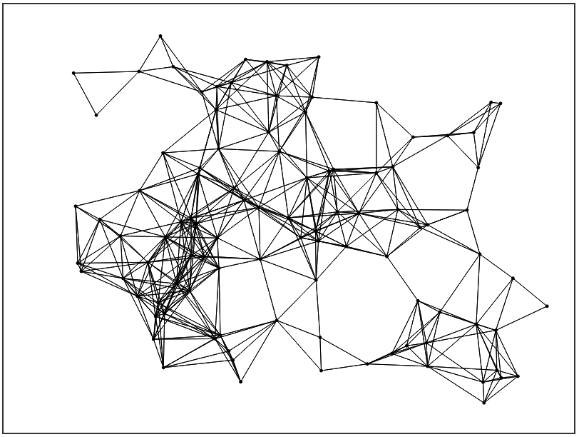

A simple HTML5 canvas experiment. Dots move in random directions within the canvas and connect to each other with a thin black line if they're within a distance of 100px. It creates an interesting visual. I use this project in my header on my homepage https://www.nick-b.ca. 

